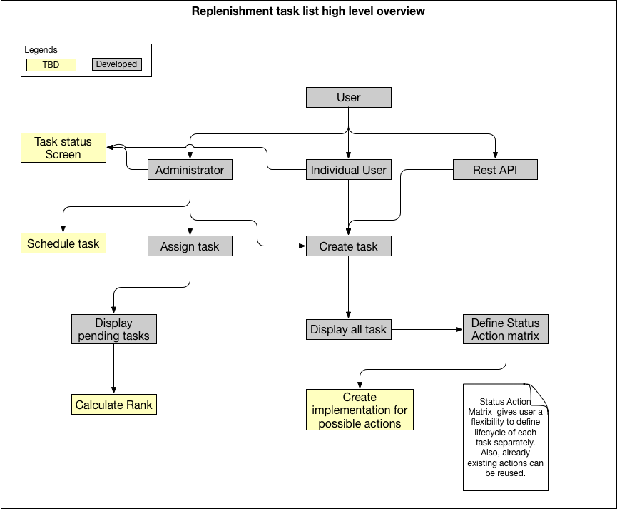

#  Walmart-Coding-Challenge-Project #
## Replenishment Manager Task Management ##

Below is the process representing developed and not developed functionality for the project:


Below is the data model created for the project:


### Steps to execute project: ###
*I was not able to successfully create war files*, becaues I am using H2 database and after creating war files update, delete and insert rights are not given (I need to explore further on how to to solve it). So, I have uploaded my complete project on github. If it is exported to eclipse directly, one should be able to execute it. Below are the different software versions I have used:
* Spring mvc version - 4.0.6
* Apache Tomcat Version 8.0
* Hibernate version - -4.0.1
* Junit vresion 4.11
* maven version 3.5.1
* Test REST API -- Jackson version 2.5.1
* Database H2 Embedded mode
* Java version 1.8

## Problem Statement Understanding #
Today’s replenishment managers need to do repetitive tasks and they need a workspace to manage all their tasks. Experience users should curate a task list, however individual user can also add a new task. Also, task should be created from outside. Below are the functionalities needed to complete this coding challenge:
1.	User authorization to distinguish individual / experience user.
2.	Develop “Create task” user interface.
3.	Develop “Create task” Rest API.
4.	Display all tasks
5.	Capability to define lifecycle of each individual task.
6.	Assign task to user interface. Same task can be assigned multiple times to different users and different times.
7.	Status tracking with comment and feedback capture at each stage.
8.	Pending task report. 
9.	Capability to schedule task automatically.
10.	Rank Algorithm for each task.
11.	Unit test for development.


*In the given time frame, I was able to complete as follows:*
1.	***User authorization***: Role based authentication 
   **Currently developed**: while creating new user, role of “admin” or “individual” can be assigned to user at registration         page. This role shall be used later on in the application. Landing page have two different sign-in buttons one for admin        and one for other users. Below is the role-based responsibility of each user:
    *	Admin can create and assign task to individual user. 
    *	Admin should define status action matrix for each task.
    *	User can create task and task created by user can be picked by that user to execute.
    **TBD**: Merge both of those two sign-in buttons in single sign-in button. 
2.	***“Create task” UI***: 
  * **Currently Developed**: Create task interface shall be used both by admin and individuals. From landing page after signing-in depending upon role separate landing page will be displayed. Clicking on button “Create task” will go to create task page.
  * **TBD**: Have frequency also to be stored in database, so application is able to trigger the job using Spring Batch.
3.	***Create task through rest API***: Tasks can also be created using rest API call. Below is the example for that:
* POST method
* URL: `http://localhost:8080/ReplenishmentTaskList/createTaskbyRest`
* sample body:
```JSON
{
	"taskName": "restTask",
	"taskDescription": "Tast created using rest API",
	"taskPriority": "very high",
	"taskEstimatedTime": 2,
	"username": "John"
}
```
4.	***Display task UI***: Display task UI displays all the existing tasks in the system to administrator and self-created task to individual user. From here user can define status action matrix for each individual task.
5.	***Status & Action Matrix***: 
  * **Currently Developed**: From display task screen user can go to status and action matrix for each task. They can define what action should be taken for a task to transition from one status to next status. Also, error status during that transition can be defined.
  * **TBD**: Each action should have separate implementation. This should be achieved either using interface or abstract class with dependency injection from spring framework. This would give user a flexibility that if action is already defined and coded, then by changing configuration different actions can be for transitioning from one status to another.
6.	***Task Assignment Screen***: This screen is used by administrator to assign task to individual user. This functionality is achieved using display task UI.
7.	***Status tracking Screen***: This screen is not developed yet. Idea is to use this screen in conjunction with status action matrix.
8.	***Pending task report***: Currently pending task report is visible only to administrators.
9.	***Auto Scheduling***: This functionality is not developed yet in the project. It should be achieved with task master data having a field frequency. Depending upon the frequency task would be scheduled automatically.
10.	***Rank Algorithm***: It is not developed yet.
11.	***Unit test***: Few unit tests has been defined using JUnit. For rest of the methods JUnit tests are yet to be developed.
